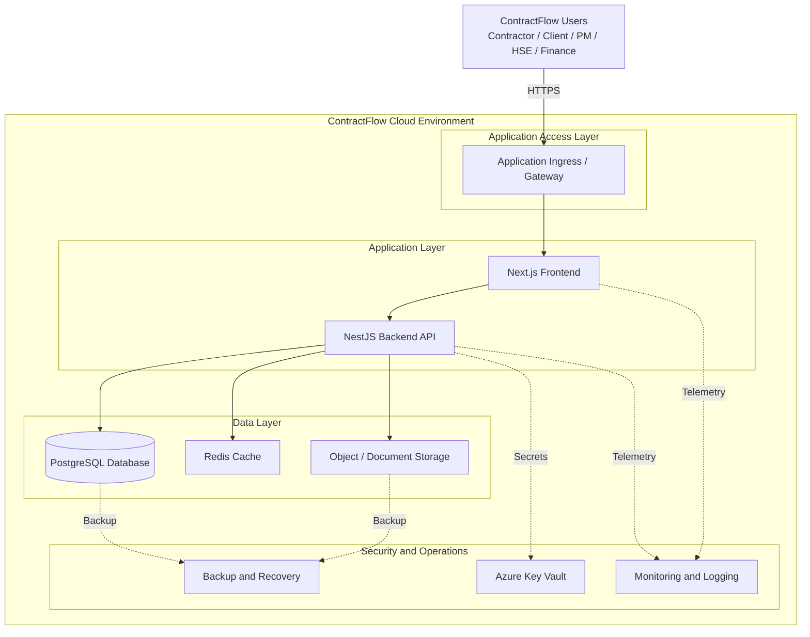
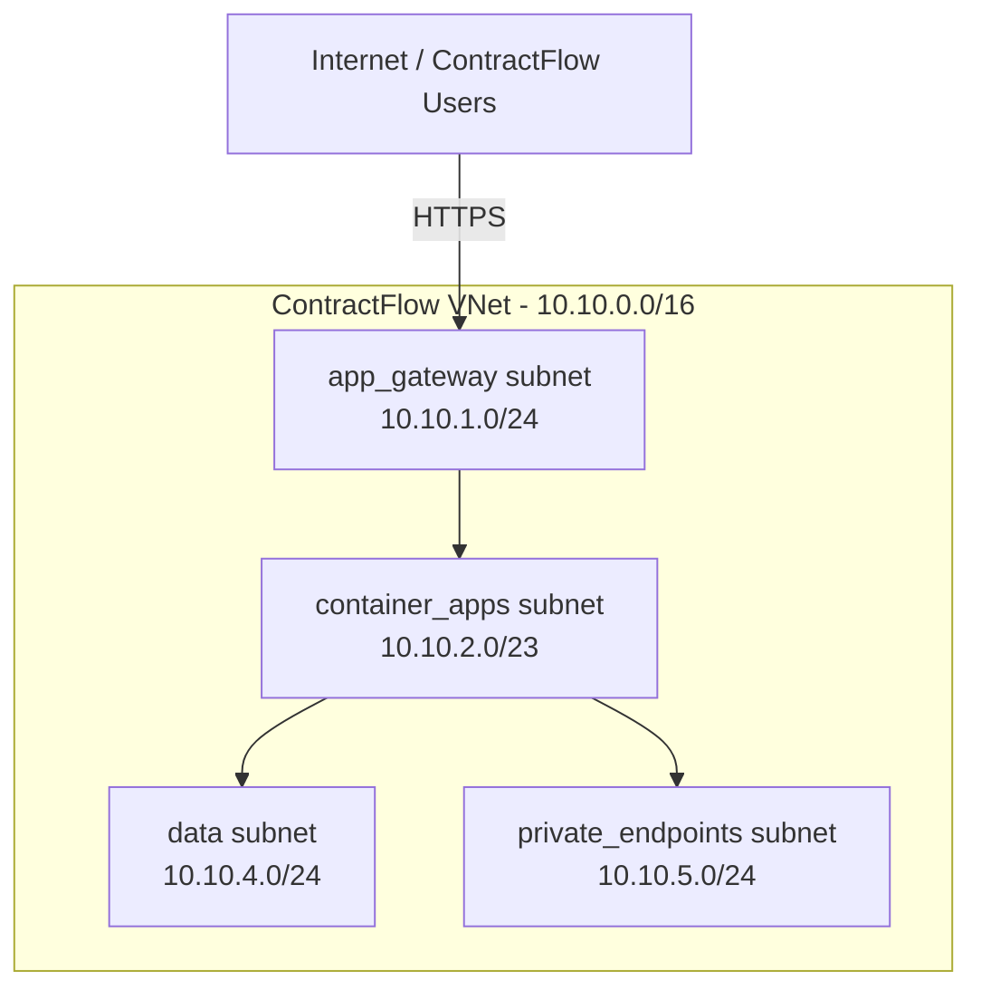
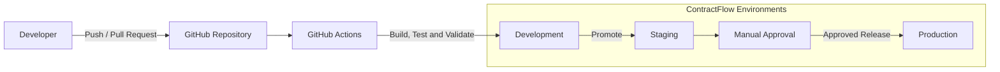

# ContractFlow Cloud Architecture

## 1. Purpose

This document describes the proposed cloud architecture for the ContractFlow platform and provides a common technical reference for the Cloud, Software Engineering, and Data Analysis teams.

The architecture is designed to support secure application hosting, network isolation, secrets management, data storage, monitoring, automated deployment, backup and recovery, and infrastructure management using Infrastructure as Code (IaC).

This document will evolve as the project moves from local development through Dev, Staging, and Production environments.

---

## 2. Current Architecture Status

ContractFlow is currently under active development. The application stack and local development infrastructure have been established, while the Azure cloud infrastructure is being developed incrementally using Terraform.

### Currently Implemented in Terraform

- Azure Resource Group
- Azure Virtual Network (VNet)
- Dedicated application, data, and private endpoint subnets
- Azure Key Vault
- Environment-based Terraform variables
- Terraform outputs for infrastructure integration

### Planned Cloud Components

The following components form part of the target architecture but are not yet fully provisioned through Terraform:

- Application hosting for the Next.js frontend
- Application hosting for the NestJS backend API
- Managed PostgreSQL database
- Object/document storage
- Redis/cache service, subject to confirmed application requirements
- Application ingress and secure external access
- Private endpoints and private service connectivity
- Centralized monitoring and logging
- Backup and disaster recovery
- CI/CD deployment pipelines
- Staging and Production environments

### Architecture Decisions Pending

The following decisions require further technical and project review:

- Final Production cloud hosting location
- Implementation approach for the project's Nigeria data-residency requirement
- Final Azure compute service for the frontend and backend
- Production object-storage technology
- Production Redis/cache requirement
- Backup and disaster-recovery locations

---

## 3. Application and Infrastructure Architecture

ContractFlow follows a layered application architecture consisting of a web frontend, backend API, relational database, caching layer, and object storage.

### Application Stack

| Layer                | Current Technology        | Purpose                                               |
| -------------------- | ------------------------- | ----------------------------------------------------- |
| Frontend             | Next.js                   | User interface and web application                    |
| Backend API          | NestJS                    | Business logic and REST API                           |
| Database             | PostgreSQL                | Structured relational application data                |
| ORM                  | Prisma                    | Database access and schema management                 |
| Cache                | Redis                     | Local cache service; production usage to be confirmed |
| Object Storage       | MinIO (local development) | S3-compatible local object storage                    |
| Infrastructure       | Terraform                 | Infrastructure as Code                                |
| Local Infrastructure | Docker Compose            | Runs development infrastructure locally               |

### Logical Data Flow

```text
Contractor / Client / Project Users
                |
              HTTPS
                |
        Application Entry Point
                |
        +-------+-------+
        |               |
    Next.js Web      NestJS API
                        |
             +----------+----------+
             |          |          |
        PostgreSQL    Redis    Object Storage
             |
       Application Data

Supporting Services
        |
        +-- Secrets Management
        +-- Monitoring and Logging
        +-- Network Security
        +-- Backup and Recovery
        +-- CI/CD
```

### Target ContractFlow Cloud Architecture



> **Status:** This represents the target ContractFlow cloud architecture. Some components are planned and have not yet been provisioned in Terraform.

---

## 4. Azure Network Architecture

The current Terraform foundation defines a dedicated Azure Virtual Network for the ContractFlow Dev environment.

### Current Terraform Network Design



> **Note:** The Terraform currently defines these subnet ranges. The subnet names represent their intended architectural roles and do not by themselves indicate that Application Gateway, Container Apps, or private endpoints have already been deployed.

### Virtual Network

- **VNet Name:** `contractflow-dev-vnet`
- **Address Space:** `10.10.0.0/16`

The VNet is divided into separate subnets so that application, data, ingress, and private connectivity components can be isolated from one another.

| Subnet              | Address Range  | Intended Purpose                                            |
| ------------------- | -------------- | ----------------------------------------------------------- |
| `app_gateway`       | `10.10.1.0/24` | Reserved for application ingress/gateway services           |
| `container_apps`    | `10.10.2.0/23` | Reserved for application hosting workloads                  |
| `data`              | `10.10.4.0/24` | Reserved for database and data-related services             |
| `private_endpoints` | `10.10.5.0/24` | Reserved for private connectivity to managed Azure services |

### Network Design Principle

The network design follows a segmented architecture. Public-facing application components should not expose database or internal data services directly to the internet.

The intended traffic pattern is:

```text
Internet / Users
       |
    HTTPS
       |
Application Ingress
       |
Application Layer
       |
Private Connectivity
       |
Data Services
```

---

## 5. Secrets and Identity Management

Azure Key Vault is included in the current Terraform foundation to provide centralized management of application secrets and sensitive configuration.

The Dev environment currently defines a Key Vault with the following naming pattern:

```text
contractflow-dev-kv
```

---

## 6. Environment Strategy

ContractFlow will use separate environments to reduce deployment risk and prevent development activities from directly affecting Production workloads.

The target environment model consists of:

| Environment       | Purpose                                                                                    | Data Approach                                                                               |
| ----------------- | ------------------------------------------------------------------------------------------ | ------------------------------------------------------------------------------------------- |
| Development (Dev) | Application development, integration, and infrastructure testing                           | Test, synthetic, or approved non-production data                                            |
| Staging           | Pre-production validation, integration testing, security testing, and release verification | Controlled non-production data                                                              |
| Production (Prod) | Live ContractFlow application and operational workloads                                    | Production data subject to approved security, residency, backup, and retention requirements |

### Development Environment

The Dev environment is the first cloud environment being defined through Terraform.

The current Terraform configuration uses:

```text
project_name = "contractflow"
environment  = "dev"
location     = "eastus"
```

---

## 7. CI/CD and Git Branch Strategy

ContractFlow will use Git-based collaboration and automated CI/CD pipelines to support controlled application and infrastructure changes.

The objective is to ensure that changes are reviewed, tested, and promoted through the appropriate environment before reaching Production.

### CI/CD Deployment Flow



> **Status:** This diagram represents the intended ContractFlow CI/CD deployment flow. The final workflow will depend on the approved cloud hosting platform and environment configuration.

### Branching Approach

The repository currently uses dedicated branches for different areas of work.

A simplified Cloud collaboration model is:

```text
main
 |
 +-- Infrastructure
        |
        +-- cloud/<engineer-or-task-name>
```

## 8. Monitoring, Logging and Observability

ContractFlow requires centralized monitoring and logging so that application health, infrastructure performance, security events, and operational failures can be detected and investigated.

The monitoring architecture should eventually cover both application and infrastructure layers.

### Monitoring Objectives

The monitoring platform should provide visibility into:

- Frontend availability
- Backend API availability
- Application errors
- API response times
- Database connectivity
- Infrastructure health
- Authentication failures
- Security events
- Resource utilization
- Deployment failures

### Application Monitoring

The Next.js frontend and NestJS backend should expose sufficient application telemetry for troubleshooting and performance analysis.

The backend should support monitoring of:

- Request volume
- HTTP response codes
- API latency
- Unhandled exceptions
- Database failures
- Authentication failures

### Infrastructure Monitoring

Cloud infrastructure should be monitored for:

- CPU and memory utilization
- Network activity
- Availability
- Service health
- Storage capacity
- Database performance
- Resource failures

### Centralized Logging

Application and infrastructure logs should be collected centrally rather than relying only on local server logs.

Potential Azure monitoring services include:

- Azure Monitor
- Application Insights
- Log Analytics

The final monitoring implementation should be selected according to the approved hosting architecture.

### Alerting

Alerts should be configured for important operational events such as:

- Application unavailability
- Repeated authentication failures
- High error rates
- Database connectivity failures
- Resource exhaustion
- Failed deployments
- Backup failures

Alert thresholds should be environment-specific and reviewed as the platform matures.

---

## 9. Backup and Disaster Recovery

ContractFlow requires a backup and disaster-recovery strategy to protect application data and support recovery from accidental deletion, infrastructure failure, application failure, or other service disruptions.

The backup strategy should cover all components that contain important or persistent data.

### Backup Scope

The Production backup strategy should consider:

- PostgreSQL database data
- Uploaded documents and object storage
- Application configuration
- Infrastructure configuration
- Audit and activity records
- Critical logs where retention is required

Terraform source code is maintained through Git version control and should not be treated as a replacement for application-data backups.

### Database Recovery

The managed PostgreSQL implementation should support an appropriate backup and recovery mechanism.

The final database design should define:

- Backup frequency
- Backup retention period
- Point-in-time recovery requirements
- Recovery Point Objective (RPO)
- Recovery Time Objective (RTO)
- Backup access controls
- Backup encryption
- Recovery testing procedures

### Object Storage Recovery

ContractFlow documents and uploaded files should be protected against accidental deletion, corruption, or unauthorized modification.

The final object-storage design should consider:

- Versioning where supported
- Retention requirements
- Soft-delete capabilities
- Encryption
- Access logging
- Recovery procedures

### Disaster Recovery

The disaster-recovery design must align with the approved Production hosting and data-residency requirements.

A secondary recovery location should not be selected automatically if doing so would cause regulated or restricted Production data to be stored outside an approved geographic boundary.

### Recovery Testing

Backups should not only be created; they should also be tested periodically.

Recovery testing should verify that:

- Database data can be restored
- Documents can be recovered
- Application configuration can be reconstructed
- Infrastructure can be recreated from approved Terraform code
- Recovery procedures are documented and repeatable

---

## 10. Data Residency and Compliance

Data residency is a key architecture consideration for ContractFlow.

The project has identified a requirement for applicable Production data to remain physically resident in Nigeria. The final Production architecture must therefore be reviewed against this requirement before live operational data is deployed.

### Current Dev Configuration

The current Terraform Dev configuration specifies:

```text
location = "eastus"
```

This value represents the current development configuration and must not be interpreted as an approved Production hosting location.

Development environments should use test, synthetic, anonymized, or otherwise approved non-production data where required by project policy.

### Production Residency Decision

Before Production deployment, the Cloud team should confirm:

- Physical location of the primary database
- Physical location of uploaded documents and object storage
- Location of database replicas
- Location of backups and snapshots
- Disaster-recovery location
- Location of sensitive logs and audit records
- Location of other services that persist Production data

The Production architecture should not be approved solely because a service has a Nigerian network presence or edge endpoint. The physical location of persistent data and relevant processing infrastructure must be considered.

### Compliance by Design

The Cloud architecture should support compliance through technical controls such as:

- Encryption in transit
- Encryption at rest
- Role-Based Access Control (RBAC)
- Least-privilege access
- Secure secrets management
- Audit logging
- Backup and recovery controls
- Data-retention controls
- Environment separation
- Controlled administrative access

### Architecture Decision Status

The final Production hosting provider, region, and data-residency implementation remain architecture decisions that require confirmation before Production deployment.

Until these decisions are approved, the Terraform configuration should be treated as an evolving infrastructure foundation rather than evidence that the Production residency requirement has been satisfied.

---

## 11. Local-to-Cloud Service Mapping

The ContractFlow local development environment uses Docker Compose to provide the supporting infrastructure required by the application.

The current local development stack consists of:

| Component              | Local Technology                | Local Port | Cloud Requirement                                                        |
| ---------------------- | ------------------------------- | ---------: | ------------------------------------------------------------------------ |
| Frontend               | Next.js                         |       3000 | Managed application hosting                                              |
| Backend API            | NestJS                          |       3001 | Managed application/API hosting                                          |
| Relational Database    | PostgreSQL 17                   |       5432 | Managed PostgreSQL service                                               |
| Cache                  | Redis 7                         |       6379 | Managed cache service if required by the application                     |
| Object Storage         | MinIO                           |       9000 | Production object/document storage                                       |
| Object Storage Console | MinIO Console                   |       9001 | Administrative capability; not intended as a public Production interface |
| Secrets                | `.env` during local development |        N/A | Azure Key Vault or approved secret-management service                    |
| Infrastructure         | Docker Compose                  |        N/A | Terraform-managed cloud infrastructure                                   |

### Local Development Flow

```text
Developer Browser
       |
       v
Next.js :3000
       |
       v
NestJS API :3001
       |
       +----------+----------+
       |          |          |
 PostgreSQL     Redis       MinIO
    :5432       :6379       :9000
```

Docker Compose is used to make these supporting services available consistently during local development.

### Cloud Transition

Moving ContractFlow to the cloud does not mean copying the local Docker environment exactly.

The Cloud team should determine the appropriate managed service for each application dependency while maintaining compatibility with the Software Engineering team's application requirements.

Particular attention is required for object storage because the local MinIO service provides an S3-compatible interface. The Production storage technology should therefore be selected together with the Software Engineering team to ensure that the backend storage implementation is compatible with the selected cloud service.

---

## 12. Infrastructure as Code Strategy

ContractFlow uses Terraform as the Infrastructure as Code (IaC) tool for defining and managing cloud infrastructure.

The objective is to make infrastructure:

- Repeatable
- Reviewable
- Version controlled
- Environment aware
- Consistently configured
- Easier to reproduce and recover

### Current Terraform Structure

The repository currently contains the following structure:

```text
infra/terraform/
|
+-- main.tf
+-- providers.tf
+-- variables.tf
+-- outputs.tf
+-- versions.tf
|
+-- environments/
|   +-- dev/
|       +-- dev.tfvars
|
+-- modules/
    +-- resource-group/
    +-- network/
    +-- key-vault/
```

### Current Terraform Modules

#### Resource Group Module

Creates the Azure Resource Group that acts as the logical container for ContractFlow Dev resources.

Current naming pattern:

```text
contractflow-dev-rg
```

#### Network Module

Defines the ContractFlow Virtual Network and its subnet structure.

Current VNet address space:

```text
10.10.0.0/16
```

Current subnet allocation:

```text
app_gateway       -> 10.10.1.0/24
container_apps    -> 10.10.2.0/23
data              -> 10.10.4.0/24
private_endpoints -> 10.10.5.0/24
```

#### Key Vault Module

Defines the Azure Key Vault foundation for centralized secrets management.

Current naming pattern:

```text
contractflow-dev-kv
```

### Terraform Workflow

Infrastructure changes should follow a controlled workflow:

```text
Terraform Code Change
        |
        v
terraform fmt
        |
        v
terraform validate
        |
        v
terraform plan
        |
        v
Peer Review
        |
        v
Approved terraform apply
```

A `terraform plan` should be reviewed before infrastructure changes are applied, particularly for Staging and Production.

### Terraform State

Terraform state contains important information about managed infrastructure and should not be treated as an ordinary source-code file.

As the project moves beyond local experimentation, the Cloud team should define an approved remote-state approach that supports:

- Secure state storage
- Encryption
- Controlled access
- State locking where supported
- Backup and recovery
- Separation between environments

Sensitive Terraform state should not be committed directly to the Git repository.

---

## 13. Implementation Roadmap and Architecture Decisions

The Cloud architecture will be implemented incrementally as application requirements and Production hosting decisions are finalized.

### Current Foundation

The following items are currently represented in the Terraform foundation:

- Resource Group
- Virtual Network
- Network subnets
- Key Vault
- Dev environment variables
- Terraform outputs
- Reusable Terraform modules

### Next Infrastructure Priorities

The next Cloud implementation stages should consider:

1. Validate the existing Terraform foundation.
2. Confirm application runtime requirements with the Software Engineering team.
3. Confirm database requirements with the Software Engineering and Data Analysis teams.
4. Finalize the Dev application-hosting approach.
5. Define PostgreSQL cloud deployment.
6. Define Production-compatible object storage.
7. Confirm whether Redis is required by the deployed application.
8. Implement centralized monitoring and logging.
9. Establish CI/CD pipelines.
10. Implement secure workload authentication and secrets integration.
11. Define backup and recovery controls.
12. Introduce Staging infrastructure.
13. Finalize the Production hosting and data-residency architecture.
14. Implement Production infrastructure only after the relevant architecture decisions are approved.

### Open Architecture Decisions

| Decision                                         | Current Status                               |
| ------------------------------------------------ | -------------------------------------------- |
| Dev cloud provider                               | Azure Terraform foundation currently defined |
| Dev Azure location                               | `eastus` currently configured                |
| Production hosting location                      | Pending approval                             |
| Nigeria Production data-residency implementation | Pending architecture decision                |
| Frontend cloud hosting                           | Pending final selection                      |
| Backend API cloud hosting                        | Pending final selection                      |
| Managed PostgreSQL implementation                | Planned                                      |
| Production object storage                        | Pending compatibility and residency review   |
| Production Redis requirement                     | To be confirmed                              |
| Monitoring and logging                           | Planned                                      |
| CI/CD implementation                             | Planned                                      |
| Backup and disaster recovery                     | Planned                                      |
| Staging environment                              | Planned                                      |
| Production environment                           | Pending architecture and residency approval  |

Architecture decisions should be updated in this document as they are agreed by the relevant teams.

---

## 14. Architecture Ownership and Collaboration

Cloud architecture is a shared technical responsibility that depends on requirements from multiple ContractFlow teams.

### Cloud / DevOps Responsibilities

The Cloud team is primarily responsible for:

- Cloud infrastructure design
- Network architecture
- Infrastructure as Code
- Environment strategy
- Secrets-management infrastructure
- Cloud identity and access controls
- CI/CD infrastructure
- Monitoring and alerting
- Backup and recovery architecture
- Infrastructure security
- Cloud cost and operational considerations

### Software Engineering Collaboration

The Cloud and Software Engineering teams should jointly agree on:

- Application runtime requirements
- Frontend and backend deployment requirements
- Environment variables
- Health checks
- Application ports
- Storage integration
- Database connectivity
- Deployment procedures
- CI/CD application stages

### Data Analysis Collaboration

The Cloud and Data Analysis teams should jointly consider:

- Database requirements
- Data classification
- Sensitive data handling
- Data retention
- Data access requirements
- Backup requirements
- Data residency requirements

### Architecture Principle

Infrastructure decisions should be based on confirmed application and data requirements rather than selecting cloud services in isolation.

The architecture should remain secure, maintainable, scalable, cost-aware, and aligned with approved project requirements as ContractFlow progresses toward Production.
